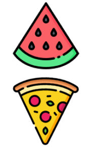
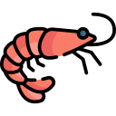

# Nutri Hi-Lo
###### CITS3403 Group Project - University of Western Australia

Developed by Huxley Berry, Djimon Jayasundera & Chantelle Kerr

---

**Nutri Hi-Lo** is an educational game that gives the user knowledge on nutritional information on everyday foods. 

The game creates a random set of 11 different food choices everyday aswell as the *nutrient of the day*. The user is given two foods to choose from and must pick the food that they believe has the highest nutritional value. 


#### Nutrient of the day

&nbsp;**Monday:** Fat  
&nbsp;**Tuesday:** Fibre  
&nbsp;**Wednesday:** Iron  
&nbsp;**Thursday:** Protein  
&nbsp;**Friday:** Sodium  
&nbsp;**Saturday:** Sugar  
&nbsp;**Sunday:** Calcium  


## Architecture
Nutri Hi-Lo is a Flask-based website utilising a RESTful API for communication between the backend and frontend. It uses several extensions that enhance the functionality

###### Backend
- **Flask-sqlalchemy** provides communication with the SQLite database
- **Flask-login** manages user login and registration
- **Flask-migrate** handles database schema changes by performing migrations 
- **Unittest** used for automated testing of models, API endpoints
- **Selenium** automatically tests the client side workflow

###### Frontend
- **HTML** structures the website
- **Javascript** handles DOM manipulation
- **Bootstrap** provides the base styling to the website
- **CSS** used to create custom styling 
- **AJAX** used to make requests to the backend


## Setup Project

Run the following commands
###### Clone the Project
```
git clone https://github.com/ChantelleKerr/cits3403-group-project
```
*Navigate inside the cits3403-group-project folder*
###### Create Virtual Environment
```
python3 -m venv venv
```
###### Activate Virtual Environment
```
# Mac / WSL
source venv/bin/activate

# Windows (command prompt)
venv\Scripts\activate
```
###### Install Dependencies
```
pip3 install -r requirements.txt
```
## Setup Database
```
todo
```

## Create An Admin Account
*Having an admin account gives you **extra functionality** within the website!*

In your terminal type the following commands!
```
1. "python3" (you may have to use "python" instead)
2. from app import db
3. from app.models import User
4. u = User(username="admin", email="admin@admin.com", is_admin=True)
5. u.set_password("adminpassword")
6. db.session.add(u)
7. db.session.commit()
```

Now you should be able to login using your admin account!

## Run Project
In the terminal type the following command to start the project. It will return a url that will direct you to the projects home page!
```
flask run
```

## Run Unit Tests
###### User Tests
Tests multiple user functionality including authorisation and password hashes.
```
python3 -m unittest app/tests/user_test.py
```
###### Analysis Tests
TODO: description
```
TODO
```
###### Selenium Tests
The test opens up FireFox and simulates navigation that a user may take while using our website. Please made sure the server is running as we are performing client side testing  
***Note**: This test will run for 30 seconds*
```
python3 -m unittest app/tests/selenium.py
```

#### References
###### Food Database
[Food Standards Database](https://www.foodstandards.gov.au/science/monitoringnutrients/afcd/Pages/foodsearch.aspx)

###### Images
[Unsplash](https://unsplash.com/)
[iStockPhoto](https://www.istockphoto.com/)
###### Icons
[Flaticon](https://www.flaticon.com/)

